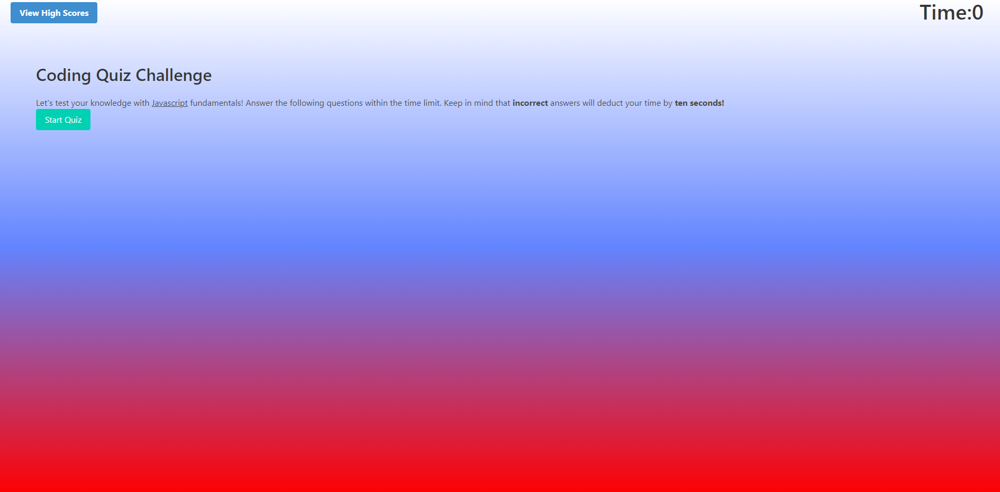

# Crazy Cool Coding Quiz

# Description

* User will see on first glance top left a button to view High Scores & top right a timer showing "time:0".

* When user clicks on "Start Quiz".
* then user will be presented with a series of multiple choice questions & timer will begin with 150 secs.

* If question is answered correctly it will add 1 score but if incorrect it will deduct 10 seconds from timer.
* Once a question is answered it will display if the question is correct or wrong, if wrong it will display the correct answer.
* After all questions are answered, user can enter initials and score to submit it to the High Scores list which is saved in local storage
* then it will show the list of highscores
* User will then have the option to click on "go back" button to go back to start screen. 
* User may also click on the "view highscores" button and click on "clear highscores" button to clear any saved scores

# Languages 

* HTML
* Javascript
* CSS & Bulma (CSS Framework)

# Preview

## Credits

Thanks to all the TA's and Classmates in my MSU Bootcamp3

## Installation

